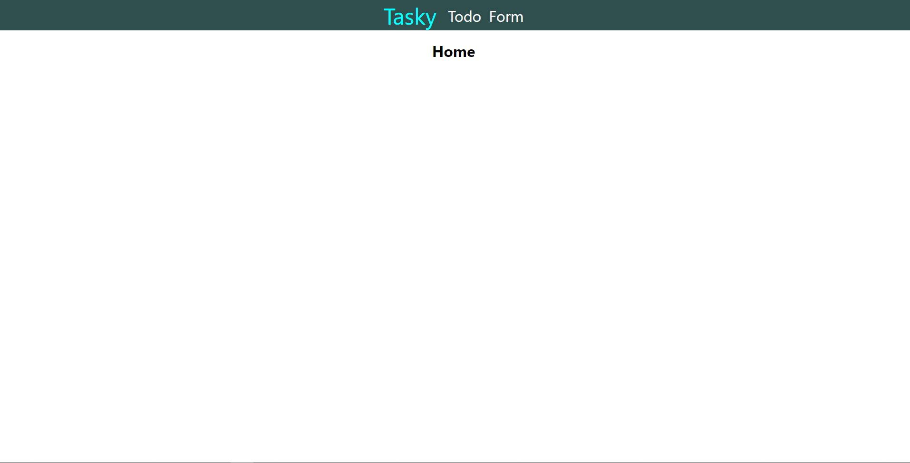

# Tasky

## Views

### Home 
This is the home view of the page, currently the only thing this page contains is the text "Home" to indicate the current page. 

### Todo
This page currently contains some pre-made todo items that when ticked will cross the line of said item.
I do this using the useState function by adding the items to a list of isChecked when the box is checked and changing the className of 
the items in this list.

### Form
This view contains a form where you can write down a task, when sent, it creates a modal that confirms that the page received your input.
I do this by creating two useStates where one keeps track of the Todo and the other keeps track of when to show the modal.  

Currently there is no further functionality with this form, it does not add it to the current Todo list.  

This is the view before the user sends the form.

This is the view after the user sent a form.

